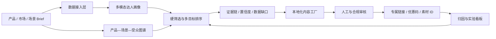

# 系统架构

CreatorPulse 将达人发现、内容本地化和效果归因连接为一个可学习闭环。比赛 MVP 使用本地合成数据与确定性算法，生产版本可替换为授权数据接口、向量检索和经审核的模型服务。

## 四层架构

### 1. 数据画像层

- 平台授权 API、公开数据、影石历史合作数据
- 国家、语言、受众市场、运动场景、内容风格
- 互动、完播、点击、转化、报价、履约和品牌安全
- 生产版本可加入视频画面、口播与评论的多模态理解

### 2. 匹配决策层

- 硬筛选：预算、品牌安全、场景相关度
- 软排序：场景、受众、内容、互动、转化、成本与可靠性
- 同时输出分数、证据链、置信度和数据缺口

### 3. 本地化内容层

- 依据市场语言、达人风格和产品营销标签生成合作 Brief
- 生成开场钩子、镜头结构、CTA 与合规提醒
- 保留本地运营人工审核节点

### 4. 归因学习层

- 使用 UTM、优惠码、素材 ID 和落地页事件追踪效果
- 通过 AI 推荐组与人工选人组对照实验估计增量
- 把结果转化为下一轮权重和预算建议

## MVP 与生产版本的关系

| 能力 | MVP | 生产版本 |
|---|---|---|
| 数据 | 合成 CSV | 授权 API 与内部数据仓库 |
| 场景识别 | 结构化标签 | 多模态模型与场景图谱 |
| 匹配 | 确定性加权评分 | 学习排序 + 约束优化 |
| 内容 | 本地化模板 | 经审核的生成式模型 |
| 归因 | 模拟预测 | 真实事件、对照实验与增量分析 |

